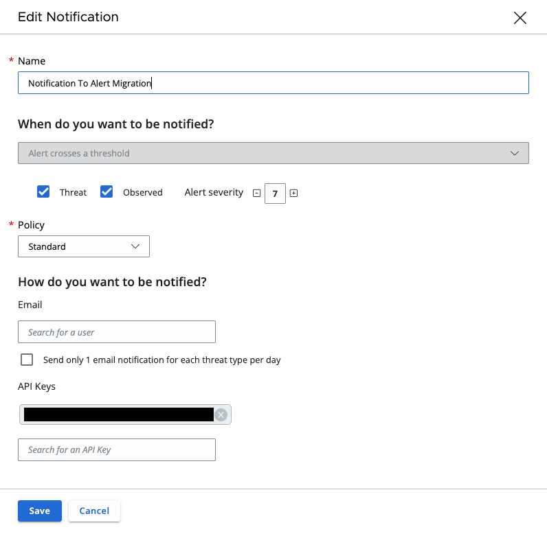

Alerts
======

Use alerts to get notifications about monitored activities such as the
appearance or spread of risky files on your endpoints. The Carbon Black Cloud Python SDK provides
an easy way to search, investigate and set the workflow of Alerts using python classes instead of raw requests.

You can use all the operations shown in the API, such as retrieving, filtering, closing, and adding notes to the
alert or the associated threat.
You can locate the full list of operations and attributes in the  :py:mod:`Alert() <cbc_sdk.platform.alerts.Alert>` class.

Resources
---------
* `API Documentation <https://developer.carbonblack.com/reference/carbon-black-cloud/platform/latest/alerts-api/>`_ on Developer Network
* `Alert Search Fields <https://developer.carbonblack.com/reference/carbon-black-cloud/platform/latest/alert-search-fields/>`_ on Developer Network
* Example script in `GitHub <https://github.com/carbonblack/carbon-black-cloud-sdk-python/tree/develop/examples/platform>`_
* If you are updating from SDK version 1.4.3 or earlier, see the `alerts-migration`_ guide.

.. note::
    In Alerts v7, and therefore SDK 1.5.0 onwards, Observed Alerts are not included; they are an Observation. The field ``category``
    has been removed from Alert.  In other APIs where this field remains it will always have a value of ``THREAT``.
    More information is available
    `here <https://carbonblack.vmware.com/blog/announcing-alerts-v7-api-and-%E2%80%9Cobserved-alerts%E2%80%9D-become-%E2%80%9Cobservations%E2%80%9D>`_.

Retrieve Alerts
---------------

By using the following the example, you can retrieve the last 5 ``[:5]`` alerts that have a minimum severity level of ``7``.

.. code-block:: python

    >>> from cbc_sdk import CBCloudAPI
    >>> from cbc_sdk.platform import Alert
    >>> api = CBCloudAPI(profile='sample')
    >>> alerts = api.select(Alert).set_minimum_severity(7)[:5]
    >>> print(alerts[0].id, alerts[0].device_os, alerts[0].device_name, alerts[0].category)
    d689e626-5d6a-<truncated> WINDOWS Alert-WinTest THREAT

Filter Alerts
^^^^^^^^^^^^^

Filter alerts by using the fields described in the
`Alert Search Schema <https://developer.carbonblack.com/reference/carbon-black-cloud/platform/latest/alert-search-fields/>`_.

Set required values for specific fields by using the ``add_criteria()`` method to limit the number of returned alerts.
Use this method for fields that are identified in the `Alert Search Fields <https://developer.carbonblack.com/reference/carbon-black-cloud/platform/latest/alert-search-fields/>`_
with "Searchable Array".
The following snippet limits returns to specific devices, where the device_id is an integer and the device_target_value
is a string.

.. code-block:: python

    >>> from cbc_sdk import CBCloudAPI
    >>> from cbc_sdk.platform import Alert
    >>> api = CBCloudAPI(profile='sample')
    >>> alerts = api.select(Alert).add_criteria("device_id", [123, 456])
    >>> alerts = api.select(Alert).add_criteria("device_target_value", ["MISSION_CRITICAL", "HIGH"])

Fields in the `Alert Search Fields <https://developer.carbonblack.com/reference/carbon-black-cloud/platform/latest/alert-search-fields/>`_
identified only with "Searchable" require the criteria to be a single value instead of a list of values.
The SDK has hand-crafted methods to set the criteria for these fields.

The following code snippet shows the methods for ``alert_notes_present`` and ``set_minimum_severity``, and the
alerts that meet each criteria

.. code-block:: python

    >>> alerts = api.select(Alert).set_alert_notes_present(True)
    >>> print(len(alerts))
    3
    >>> alerts = api.select(Alert).set_minimum_severity(9)
    >>> print(len(alerts))
    1072
    >>> alerts = api.select(Alert).set_minimum_severity(3)
    >>> print(len(alerts))
    69100
    >>>

You can use the ``where`` method to filter alerts. The ``where`` method supports strings and solr-like queries. Alternatively, you can use ``solrq`` query objects
for more complex searches. The following example searches by using a solr query search string for alerts
where the device_target_value is MISSION_CRITICAL or HIGH and is the equivalent of the preceding add_criteria clause.

.. code-block:: python

    >>> from cbc_sdk import CBCloudAPI
    >>> from cbc_sdk.platform import Alert
    >>> api = CBCloudAPI(profile='sample')
    >>> alerts = api.select(Alert).where("device_target_value:MISSION_CRITICAL or device_target_value:HIGH")
    >>> for alert in alerts:
    ...     print(alert.id, alert.device_os, alert.device_name, alert.device_target_value)
    8aa6272a-17cb-31c0-9352-67e45c0251f3 WINDOWS jenkin MISSION_CRITICAL
    d987a112-8b7b-18c9-43d9-76ced09d9ded WINDOWS MYDEMOMACHINE\DESKTOP-04 MISSION_CRITICAL
    0f915c4d-5652-b3e5-50d8-f4dcfc632396 WINDOWS jenkin MISSION_CRITICAL
    1f13e581-840f-1207-f661-d9b176ee9d6c WINDOWS jenkin MISSION_CRITICAL
    6ae56007-1213-4ee1-a50c-d221066ce8c9 WINDOWS MYBUILDMACHINE\Desktop-01 HIGH
    ... truncated ...

.. tip::
    When filtering by fields that take a list parameter, an empty list is treated as a wildcard and matches everything.

For example, the following snippet returns all types:

.. code-block:: python

    >>> alerts = cb.select(Alert).set_types([])

It is equivalent to:

.. code-block:: python

    >>> alerts = cb.select(Alert)

.. tip::
    More information about the ``solrq`` can be found in
    their `documentation <https://solrq.readthedocs.io/en/latest/index.html>`_.

Retrieving Alerts for Multiple Organizations
--------------------------------------------

By using the following example, you can retrieve alerts for multiple organizations.

.. code-block:: python

    >>> from cbc_sdk import CBCloudAPI
    >>> from cbc_sdk.platform import Alert
    >>> org_list = ["org1", "org2"]
    >>> for org in org_list:
    ...     org = "".join(org)
    ...     api = CBCloudAPI(profile=org)
    ...     alerts = api.select(Alert).set_minimum_severity(7)[:5]
    ...     print("Results for Org {}".format(org))
    >>> for alert in alerts:
    ...     print(alert.id, alert.device_os, alert.device_name, alert.category)

You can also read from a csv file by using values that match the profile names in a credentials.cbc file.

    >>> from cbc_sdk import CBCloudAPI
    >>> from cbc_sdk.platform import Alert
    >>> import csv
    >>> file = open ("data.csv", "r", encoding="utf-8-sig")
    >>> org_list = list(csv.reader(file, delimiter=","))
    >>> file.close()
    >>> for org in org_list:
    ...     org = "".join(org)
    ...     api = CBCloudAPI(profile=org)
    ...     alerts = api.select(Alert).set_minimum_severity(7)[:5]
    ...     print("Results for Org {}".format(org))
    >>> for alert in alerts:
    ...     print(alert.id, alert.device_os, alert.device_name, alert.category)

Retrieving Observations to Provide Context About an Alert
---------------------------------------------------------

All alert types other than Watchlist Alerts have associated Observations that provide more information
about the interesting events that contributed to the identification of an Alert.

The Alert v7 object (supported in SDK 1.5.0 onwards) has significantly more metadata when compared to the earlier
Alerts v6 API (in the SDK version 1.4.3 and earlier). Therefore, the enrichment might not be required depending on your use case.
New fields include process, child process, and parent process commandlines and IP addresses for network events. Find the
complete list of fields in the
`Alert Search Fields <https://developer.carbonblack.com/reference/carbon-black-cloud/platform/latest/alert-search-fields/>`_

Observations are part of
`Investigate Search Fields <https://developer.carbonblack.com/reference/carbon-black-cloud/platform/latest/platform-search-fields/>`_.
Available fields are identified by the route "Observation".
Methods on the Observation Class, which can be found here: :py:mod:`Observation() <cbc_sdk.platform.observations.Observation>`

.. code-block:: python

    >>> from cbc_sdk import CBCloudAPI
    >>> from cbc_sdk.platform import CBAnalyticsAlert
    >>> api = CBCloudAPI(profile="sample")
    >>> alert = api.select(Alert).add_criteria("type", "CB_ANALYTICS").first()
    >>> observations = alert.get_observations()
    >>> observations
    [<cbc_sdk.platform.observations.Observation: id a5aa40856d5511ee8059132eb84e1d6d:470147c9-d79b-3f01-2083-b30bc0c0629f> @ https://defense.conferdeploy.net]
    >>> print(observations[0].get_details())
    Observation object, bound to https://defense.conferdeploy.net.
    ------------------------------------------------------------------------------
                                 alert_id: [list:1 item]:
                                           [0]: 470147c9-d79b-3f01-2083-b30bc0c0629f
                        backend_timestamp: 2023-10-18T01:28:59.900Z
             blocked_effective_reputation: KNOWN_MALWARE
                             blocked_hash: [list:1 item]:
                                           [0]: 659e469f8dadcb6c32ab1641817ee57c327003dffa443c3...
                             blocked_name: c:\windows\system32\fltlib.dll
           childproc_effective_reputation: KNOWN_MALWARE
    childproc_effective_reputation_source: HASH_REP
                           childproc_hash: [list:1 item]:
                                           [0]: 659e469f8dadcb6c32ab1641817ee57c327003dffa443c3...
    ... truncated ...

Retrieving Processes to Provide Context About an Alert
------------------------------------------------------

You can retrieve process details on each ``WatchlistAlert`` and some other alert types by using the following example. You can use list slicing
to retrieve the first ``n`` results (in the example, this value is ``10``). The ``get_details()`` method gives metadata
that is similar to the one received by using ``Observation``.
The full list of attributes and methods are in the :py:mod:`Process() <cbc_sdk.platform.processes.Process>` class.

.. code-block:: python

    >>> from cbc_sdk import CBCloudAPI
    >>> from cbc_sdk.platform import WatchlistAlert, Process
    >>> api = CBCloudAPI(profile='sample')
    >>> alerts = api.select(WatchlistAlert)[:10]
    >>> for alert in alerts:
    ...     process = alert.get_process()
    ...     print(process.get_details())
    {'alert_id': ['0a3c45bf-fce6-4a63', '12030b8f-ce3f-48bd'], 'attack_tactic': 'TA0002' <truncated>..}
    {'alert_id': ['02f6aecd-73d7-456d', 'e47c13dd-75a9-44de'], 'attack_tactic': 'TA0002' <truncated>..}
    ... truncated ...

Get Process Events
^^^^^^^^^^^^^^^^^^

You can fetch every event that corresponds with a Process by calling ``process.events()``.

.. note::
    Because calling the events can be an intensive task, in following example fetches only the first ``10``
    events. Be cautious when calling ``all()``.

.. code-block:: python

    >>> from cbc_sdk import CBCloudAPI
    >>> from cbc_sdk.platform import WatchlistAlert, Process
    >>> api = CBCloudAPI(profile='sample')
    >>> alert = api.select(WatchlistAlert).first()
    >>> process = alert.get_process()
    >>> events = process.events()[:10]
    >>> print(events[0].event_description) # Note that I've stripped the `<share>` and `<link>` tags, which are also available in the response.
    'The application c:\\program files (x86)\\google\\chrome\\application\\chrome.exe attempted to modify the memory of "c:\\program files (x86)\\google\\chrome\\application\\chrome.exe", by calling the function "NtWriteVirtualMemory". The operation was successful.'
    ...

Device Control Alerts
---------------------

Device Control Alerts are explained in the :doc:`device-control` guide.

Container Runtime Alerts
------------------------

Container Runtime Alerts represent alerts for behavior that is noticed inside a Kubernetes container. These alerts are based on network traffic and are
triggered by anomalies from the learned behavior of workloads or applications.  For these events, the ``type`` is
``CONTAINER_RUNTIME``.  Additional fields such as ``connection_type`` and ``egress_group_name`` are also available.

To see all available fields, filter Alert Types Supported to CONTAINER_RUNTIME on the
`Alert Search Fields <https://developer.carbonblack.com/reference/carbon-black-cloud/platform/latest/alert-search-fields/>`_.

Alert Workflow
^^^^^^^^^^^^^^

The Alert Closure workflow enables Alert lifecycle management.

An alert goes through the states of Open, In Progress, and Closed. Any transition can occur, including
from Closed back to Open or In Progress.

The workflow leverages the alert search structure to specify the alerts to close.

1. Use an Alert Search to specify which Alerts will have their status updated.

    * The request body is a search request and all alerts matching the request will be updated.
    * Two common uses are to update one alert, or to update all alerts with a specific threat id.
    * Any search request can be used as the criteria to select alerts to update the alert status.

    .. code-block:: python

    >>> # This query will select only the alert with the specified id
    >>> ALERT_ID = "id of the alert that you want to close"
    >>> alert_query = api.select(Alert).add_criteria("id", [ALERT_ID])
    >>> # This query will select all alerts with the specified threat id.  It is not used again in this example
    >>> alert_query_for_threat = api.select(Alert).add_criteria("threat_id","CFED0B211ED09F8EC1C83D4F3FBF1709")

2. Submit a job to update the status of Alerts.

    * The status can be ``OPEN``, ``IN PROGRESS`` or ``CLOSED`` (previously ``DISMISSED``).
    * You may include a Closure Reason.

    .. code-block:: python

    >>> # by calling update on the alert_query, the a request to change the status
    >>> # for all alerts matching that criteria will be submitted
    >>> job = alert_query.update("CLOSED", "RESOLVED", "NONE", "Setting to closed for SDK demo")

3. The immediate response confirms that the job was successfully submitted.

    .. code-block:: python

        >>> print("job.id = {}".format(job.id))
        job.id = 1234567

4. Use the :py:mod:`Job() cbc_sdk.platform.jobs.Job` class to determine when the update is complete.

    Use the Job object to wait until the Job has completed.  The python script will wait while
    the SDK polls to determine when the job is complete.

    .. code-block:: python

    >>> job.await_completion().result()

5. Refresh the Alert Search to get the updated alert data into the SDK.

    .. code-block:: python

    >>> alert.refresh()
    >>> print("Status = {}, Expecting CLOSED".format(alert.workflow["status"]))

6. You can dismiss future Alerts that have the same threat id.

Use the sequence of calls to update future alerts that have the same threat id.  This sequence is usually used in conjunction with
    with the alert closure; that is, you can use the dismiss future alerts call to close future occurrences and call an
    alert closure to close current open alerts that have the threat id.

    .. code-block:: python

    >>> alert_threat_query = api.select(Alert).add_criteria("threat_id","CFED0B211ED09F8EC1C83D4F3FBF1709")
    >>> alert.dismiss_threat("threat remediation done", "testing dismiss_threat in the SDK")
    >>> # To undo the dismissal, call update
    >>> alert.update_threat("threat remediation un-done", "testing update_threat in the SDK")

Migrating from Notifications to Alerts
--------------------------------------

.. note::
    The Notifications API is deprecated, and deactivation is planned for 31 October 2024.

    For information about migrating from the API and alternative solutions, see
    `IntegrationService notification v3 API Migration Guide <https://developer.carbonblack.com/reference/carbon-black-cloud/guides/api-migration/notification-migration/>`_

Notifications work on a subscription-based principle and they require a SIEM authentication key.
By using that key, you are subscribing to a certain criteria of alerts. As this is deprecated, new alert types
cannot be retrieved from the notifications API.

See `the official notes <https://developer.carbonblack.com/reference/carbon-black-cloud/cb-defense/latest/rest-api/#get-notifications>`_ in the Carbon Black API website.

You can replicate the settings shown in the screenshot by running the following search on Alerts:

.. code-block:: python

    >>> from cbc_sdk import CBCloudAPI
    >>> from cbc_sdk.platform import Alert
    >>> alerts = api.select(Alert).set_minimum_severity(7).\
    >>>     add_criteria("type", ["CB_ANALYTICS", "DEVICE_CONTROL"]).\
    >>>     add_criteria("device_policy", "Standard")

High Volume and Streaming Solution for Alerts
---------------------------------------------
For near-real-time streaming of alerts, see `Data Forwarder <https://docs.vmware.com/en/VMware-Carbon-Black-Cloud/services/carbon-black-cloud-user-guide/GUID-E8D33F72-BABB-4157-A908-D8BBDB5AF349.html/>`_.
