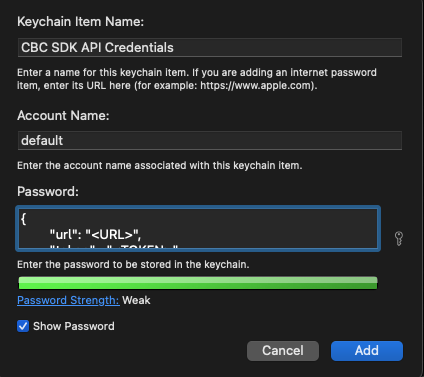

.. _authentication:

Authentication
==============

Carbon Black Cloud APIs require authentication to secure your data.

There are several methods for authentication listed below. Every method requires
one of the following type of credentials ``X-Auth-Token``, ``OAuth App with Bearer`` or ``Personal API Token``.
See the `Developer Network Authentication Guide`_ to learn how to
generate the type of credentials your implementation uses.

The SDK only uses one Authentication method at a time. It is recommended to create Authentication Methods for
specific actions, and use them as needed.

For example, if using the
`Devices API <https://developer.carbonblack.com/reference/carbon-black-cloud/platform/latest/devices-api/#search-devices>`_
to search for mission critical devices, and the
`Live Response API <https://developer.carbonblack.com/reference/carbon-black-cloud/platform/latest/live-response-api/>`_
to execute commands on those devices, generate one API credential with appropriate permissions and access level.
Store the credential with a profile name, and reference the profile when creating CBCloudAPI objects.

**Example contents of credentials.cbc file used for authentication with X-Auth-Token. Read more about the credentials.cbc below.**
::

  [platform]
  url=https://defense-prod05.conferdeploy.net
  token=ABCDEFGHIJKLMNO123456789/ABCD123456
  org_key=ABCD123456
  ssl_verify=false
  ssl_verify_hostname=no

**Example code authentication with a profile named "platform"**
::

  # import relevant modules
  >>> from cbc_sdk.platform import Device
  >>> from cbc_sdk import CBCloudAPI

  # create Platform API object
  >>> platform_api = CBCloudAPI(profile='platform')

  # search for specific devices with Platform Devices API
  >>> important_devs = platform_api.select(Device).set_target_priorities(["MISSION_CRITICAL"])

  # execute commands with Live Response API
  >>> for device in important_devs:
  ...     lr_session = platform_api.live_response.request_session(device.id)
  ...     lr_session.create_process(r'cmd.exe /c "ping.exe 192.168.1.1"')
  ...     lr_session.close()

For more examples on Live Response, check :doc:`live-response`

Authentication Methods
----------------------

:ref:`With a File`:

    Credentials may be stored in a ``credentials.cbc`` file. With support for
    multiple profiles, this method makes it easy to manage multiple API Keys for
    different products and permission levels.

    >>> cbc_api = CBCloudAPI('~/.carbonblack/myfile.cbc', profile='default')

:ref:`With Windows Registry`:

    Windows Registry is a secure option for storing API credentials on Windows systems.

    >>> provider = RegistryCredentialProvider()
    >>> cbc_api = CBCloudAPI(credential_provider=provider, profile='default')

:ref:`With macOS's Keychain Access`:

    The Keychain Access which is built into macOS can also be used for authentication.

    >>> provider = KeychainCredentialProvider('CBC API Credentials', 'default')
    >>> cbc_api = CBCloudAPI(credential_provider=provider)

:ref:`With Amazon Secrets Manger`:

    There is a support for the Amazon Secrets Manager, navigate to the section for further details of how to
    set it up.

    >>> provider = AWSCredentialProvider(secret_arn='your-secret-arn-string')
    >>> cbc_api = CBCloudAPI(credential_provider=provider)

:ref:`With an External Credential Provider`:

  Credential Providers allow for custom methods of loading API credentials. This
  method requires you to write your own Credential Provider.

  >>> provider = MyCredentialProvider()
  >>> cbc_api = CBCloudAPI(credential_provider=provider, profile='default')

**Not Recommended**:

:ref:`At Runtime`:

  Credentials may be passed into :py:mod:`CBCloudAPI() <cbc_sdk.rest_api.CBCloudAPI>`
  via keyword parameters. This method should be used with caution, taking care to not
  share your API credentials when managing code with source control.

    >>> cbc_api = CBCloudAPI(url='https://defense.conferdeploy.net', token='ABCD/1234',
    ...     org_key='ABCDEFGH')

**Not Recommended**:

:ref:`With Environmental Variables`:

    Environmental variables can be used for authentication, but pose a security risk.
    This method is not recommended unless absolutely necessary.

With a File
^^^^^^^^^^^
Credentials may be supplied in a file that resembles a Windows ``.INI`` file in structure, which allows for
multiple "profiles" or sets of credentials to be supplied in a single file.  The file format is backwards compatible with
CBAPI, so older files can continue to be used.

**Example of a credentials file containing two profiles**

::

    [default]
    url=http://example.com
    token=ABCDEFGHIJKLMNOPQRSTUVWX/12345678
    org_key=A1B2C3D4
    ssl_verify=false

    [production]
    url=http://example.com
    token=QRSTUVWXYZABCDEFGHIJKLMN/76543210
    org_key=A1B2C3D4
    ssl_verify=false
    ssl_verify_hostname=no
    ssl_cert_file=foo.certs
    ssl_force_tls_1_2=1
    proxy=proxy.example
    ignore_system_proxy=on
    integration=MyApplication/1.3.1

**Common fields** between all types of credentials

+-------------------------+---------+----------+
|  Keyword                | Default | Required |
+=========================+=========+==========+
| ``url``                 |         | Yes      |
+-------------------------+---------+----------+
|``org_key``              |         | Yes      |
+-------------------------+---------+----------+
| ``ssl_verify``          | 1       | No       |
+-------------------------+---------+----------+
| ``ssl_verify_hostname`` | 1       | No       |
+-------------------------+---------+----------+
|``ignore_system_proxy``  | 0       | No       |
+-------------------------+---------+----------+
|``ssl_force_tls_1_2``    | 0       | No       |
+-------------------------+---------+----------+
|``ssl_cert_file``        |         | No       |
+-------------------------+---------+----------+
|``proxy``                |         | No       |
+-------------------------+---------+----------+
|``integration``          |         | No       |
+-------------------------+---------+----------+
|``default_timeout``      | 300000  | No       |
+-------------------------+---------+----------+

**X-AUTH-TOKEN** specific fields

+-------------------------+---------+----------+
|  Keyword                | Default | Required |
+=========================+=========+==========+
| ``token``               |         | Yes      |
+-------------------------+---------+----------+

**OAuth App with Bearer** specific fields

+-------------------------+---------+----------+
|  Keyword                | Default | Required |
+=========================+=========+==========+
| ``csp_oauth_app_id``    |         | Yes      |
+-------------------------+---------+----------+
| ``csp_oauth_app_secret``|         | Yes      |
+-------------------------+---------+----------+

**Personal API Token** specific fields

+-------------------------+---------+----------+
|  Keyword                | Default | Required |
+=========================+=========+==========+
| ``csp_api_token``       |         | Yes      |
+-------------------------+---------+----------+

Individual profiles or sections are delimited in the file by placing their name within square brackets:
``[profile_name]``.  Within each section, individual credential values are supplied in a ``keyword=value`` format.

Unrecognized keywords are ignored.

By default, the CBC SDK looks for credentials files in the following locations:

* The ``.carbonblack`` subdirectory of the current directory of the running process.
* The ``.carbonblack`` subdirectory of the user's home directory.
* The ``/etc/carbonblack`` subdirectory on Unix, or the ``C:\Windows\carbonblack`` subdirectory on Windows.

Within each of these directories, the SDK first looks for the ``credentials.cbc`` file, then the ``credentials.psc``
file (the older name for the credentials file under CBAPI).

You can override the file search logic and specify the full pathname of the credentials file in the keyword parameter
``credential_file`` when creating the :py:mod:`CBCloudAPI <cbc_sdk.rest_api.CBCloudAPI>` object.

In all cases, you will have to specify the name of the profile to be retrieved from the credentials file in the
keyword parameter ``profile`` when creating the :py:mod:`CBCloudAPI <cbc_sdk.rest_api.CBCloudAPI>` object.

**Example:**

    >>> cbc_api = CBCloudAPI(credential_file='~/.carbonblack/myfile.cbc', profile='default')

**Note on File Security:** It is recommended that the credentials file be secured properly on Unix. It should be owned
by the user running the process, as should the directory containing it, and neither one should specify any file
permissions for "group" or "other." In numeric terms, that means the file should have ``400`` or ``600`` permissions,
and its containing directory should have ``500`` or ``700`` permissions.  This is similar to securing configuration or
key files for ``ssh``. If these permissions are incorrect, a warning message will be logged; a future version of the
CBC SDK will disallow access to files altogether if they do not have the correct permissions.

Credential files *cannot* be properly secured in this manner under Windows; if they are used in that
environment, a warning message will be logged.

With Windows Registry
^^^^^^^^^^^^^^^^^^^^^
CBC SDK also provides the ability to use the Windows Registry to supply credentials, a method which is more secure on
Windows than other methods.

**N.B.:** Presently, to use the Windows Registry, you must supply its credential provider as an "external" credential
provider.  A future version of the CBC SDK will move to using this as a default provider when running on Windows.

By default, registry entries are stored under the key
``HKEY_CURRENT_USER\Software\VMware Carbon Black\Cloud Credentials``.  Under this key, there may be multiple subkeys,
each of which specifies a "profile" (as with credential files).  Within these subkeys, the following named values may
be specified:

**Common fields** between all types of credentials

+-------------------------+----------------+---------+----------+
|  Keyword                | Value Type     | Default | Required |
+=========================+================+=========+==========+
| ``url``                 | ``REG_SZ``     |         | Yes      |
+-------------------------+----------------+---------+----------+
|``org_key``              | ``REG_SZ``     |         | Yes      |
+-------------------------+----------------+---------+----------+
| ``ssl_verify``          | ``REG_DWORD``  | 1       | No       |
+-------------------------+----------------+---------+----------+
| ``ssl_verify_hostname`` | ``REG_DWORD``  | 1       | No       |
+-------------------------+----------------+---------+----------+
|``ignore_system_proxy``  |``REG_DWORD``   | 0       | No       |
+-------------------------+----------------+---------+----------+
|``ssl_force_tls_1_2``    |``REG_DWORD``   | 0       | No       |
+-------------------------+----------------+---------+----------+
|``ssl_cert_file``        | ``REG_SZ``     |         | No       |
+-------------------------+----------------+---------+----------+
|``proxy``                | ``REG_SZ``     |         | No       |
+-------------------------+----------------+---------+----------+
|``integration``          | ``REG_SZ``     |         | No       |
+-------------------------+----------------+---------+----------+
|``default_timeout``      | ``REG_DWORD``  | 300000  | No       |
+-------------------------+----------------+---------+----------+

**X-AUTH-TOKEN** specific fields

+-------------------------+----------------+---------+----------+
|  Keyword                | Value Type     | Default | Required |
+=========================+================+=========+==========+
| ``token``               | ``REG_SZ``     |         | Yes      |
+-------------------------+----------------+---------+----------+

**OAuth App with Bearer** specific fields

+-------------------------+----------------+---------+----------+
|  Keyword                | Value Type     | Default | Required |
+=========================+================+=========+==========+
| ``csp_oauth_app_id``    | ``REG_SZ``     |         | Yes      |
+-------------------------+----------------+---------+----------+
| ``csp_oauth_app_secret``| ``REG_SZ``     |         | Yes      |
+-------------------------+----------------+---------+----------+

**Personal API Token** specific fields

+-------------------------+----------------+---------+----------+
|  Keyword                | Value Type     | Default | Required |
+=========================+================+=========+==========+
| ``csp_api_token``       | ``REG_SZ``     |         | Yes      |
+-------------------------+----------------+---------+----------+

Unrecognized named values are ignored.

To use the Registry credential provider, create an instance of it, then pass the reference to that instance in the
``credential_provider`` keyword parameter when creating :py:mod:`CBCloudAPI <cbc_sdk.rest_api.CBCloudAPI>`.  As with credential files, the name of the
profile to be retrieved from the Registry should be specified in the keyword parameter ``profile``.

**Example:**

    >>> provider = RegistryCredentialProvider()
    >>> cbc_api = CBCloudAPI(credential_provider=provider, profile='default')

.. TK: Use information for the Registry setup tool

**Advanced Usage:** The parameters ``keypath`` and ``userkey`` to ``RegistryCredentialProvider`` may be used to
control the exact location of the "base" registry key where the sections of credentials are located.  The ``keypath``
parameter allows specification of the path from ``HKEY_CURRENT_USER`` where the base registry key is located. If
``userkey``, which is ``True`` by default, is ``False``, the path will be interpreted as being rooted at
``HKEY_LOCAL_MACHINE`` rather than ``HKEY_CURRENT_USER``.

**Example:**

    >>> provider = RegistryCredentialProvider('Software\\Contoso\\My CBC Application')
    >>> cbc_api = CBCloudAPI(credential_provider=provider, profile='default')

Note the use of doubled backslashes to properly escape them under Python.

With an External Credential Provider
^^^^^^^^^^^^^^^^^^^^^^^^^^^^^^^^^^^^^
Credentials may also be supplied by writing a class that conforms to the ``CredentialProvider`` interface protocol.
When creating :py:mod:`CBCloudAPI <cbc_sdk.rest_api.CBCloudAPI>`, pass a reference to a ``CredentialProvider`` object
in the ``credential_provider`` keyword parameter. Then pass the name of the profile you want to retrieve from the
provider object using the keyword parameter ``profile``.

**Example:**

    >>> provider = MyCredentialProvider()
    >>> cbc_api = CBCloudAPI(credential_provider=provider, profile='default')

Details of writing a credential provider may be found in the
:doc:`Developing a Custom Credential Provider <developing-credential-providers>` document.

At Runtime
^^^^^^^^^^
The credentials may be passed into the :py:mod:`CBCloudAPI <cbc_sdk.rest_api.CBCloudAPI>` object when it is created
via the keyword parameters ``url``, ``token``, ``org_key``, and (optionally) ``ssl_verify`` and ``integration_name``.

**Example:**

    >>> api = CBCloudAPI(url='https://example.com', token='ABCDEFGHIJKLMNOPQRSTUVWX/12345678',
    ...                  org_key='A1B2C3D4', ssl_verify=False, integration_name='MyScript/1.0')

The ``integration_name`` may be specified even if using another credential provider. If specified as a
parameter, this overrides any integration name specified by means of the credential provider.

With Environmental Variables
^^^^^^^^^^^^^^^^^^^^^^^^^^^^
The credentials may be supplied to CBC SDK via the environment variables ``CBC_URL``, ``CBC_TOKEN``, ``CBC_ORG_KEY``,
and ``CBC_SSL_VERIFY``. For backwards compatibility with CBAPI, the environment variables ``CBAPI_URL``,
``CBAPI_TOKEN``, ``CBAPI_ORG_KEY``, and ``CBAPI_SSL_VERIFY`` may also be used; if both are specified, the newer
``CBC_xxx`` environment variables override their corresponding ``CBAPI_xxx`` equivalents. To use the environment
variables, they must be set before the application is run (at least ``CBC_URL`` or ``CBAPI_URL``, and ``CBC_TOKEN`` or
``CBAPI_TOKEN``), and the ``credential_file`` keyword parameter to :py:mod:`CBCloudAPI <cbc_sdk.rest_api.CBCloudAPI>`
must be either ``None`` or left unspecified. (The ``profile`` keyword parameter will be ignored.)

**N.B.:** Passing credentials via the environment can be insecure, and, if this method is used, a warning message to
that effect will be generated in the log.

With macOS's Keychain Access
^^^^^^^^^^^^^^^^^^^^^^^^^^^^
The SDK also supports the usage of macOS's Keychain Access. It works in a similar manner as our other authentication
methods. Keychain Access is a key-value based password storage and since we have more than one key-value based entry
we are going to use JSON to store our other entries, the JSON is going to be stored under the password value.

.. note::
    You can start first by creating the JSON object, you can do that by using our
    CLI tool(``<SDK_ROOT>/bin/set-macos-keychain.py``) or by manually creating it.
    The tool can:

        * Automatically import all of your profiles set in the ``credentials.cbc`` file. Or by setting a custom path
          to a file.
        * Manually input the values of your credentials via prompt or by using system arguments.

    Find out how to use the script in its docstring or by using ``--help``.

You can remove the keys that you won't be using or leave them empty. Reference our
:ref:`Explanation of API Credential Components`.

.. code-block:: javascript

    {
        "url": "<URL>",
        "token" : "<TOKEN>",
        "org_key": "<ORG_KEY>",
        "ssl_verify": true,
        "ssl_verify_hostname": true,
        "ssl_cert_file": "<FILE_PATH>",
        "ssl_force_tls_1_2": true,
        "proxy": "<NAME_OF_THE_PROXY_HOST>",
        "ignore_system_proxy": true,
        "integration": "<INTEGRATION_NAME>",
        "default_timeout": 300000
    }

.. note::
    When you are storing a JSON object under the password's input in Keychain it is possible to see only the ``{``
    in the input field, you can navigate with the arrows to check if the rest of the JSON is there.

Then we can move to storing that entry into the Keychain, create a new entry which looks like that:

After we've set the entry in the Keychain Access we can now authenticate our SDK using the ``KeychainCredentialProvider``.

.. code-block:: python

    >>> from cbc_sdk.credential_providers import KeychainCredentialProvider
    >>> provider = KeychainCredentialProvider('CBC API Credentials', 'default')
    >>> cbc_api = CBCloudAPI(credential_provider=provider)

You will be prompted to type your password so that python can access the keychain in order to obtain the credentials.

With Amazon Secrets Manger
--------------------------

Configure the AWS credentials
^^^^^^^^^^^^^^^^^^^^^^^^^^^^^

A full and comprehensive guide configuring the files and credentials regarding AWS can be found in their
`official documentation. <https://boto3.amazonaws.com/v1/documentation/api/latest/guide/credentials.html>`_

Adding a secret to the AWS Secrets Manager
^^^^^^^^^^^^^^^^^^^^^^^^^^^^^^^^^^^^^^^^^^

There is an official
`guide for creating a secret <https://docs.aws.amazon.com/secretsmanager/latest/userguide/manage_create-basic-secret.html>`_
by AWS.

.. note::
    Add your secrets as a key/value pairs. In the :ref:`Explanation of API Credential Components` you can find full
    information on required fields and their purpose.

Using our credential provider for the SDK
^^^^^^^^^^^^^^^^^^^^^^^^^^^^^^^^^^^^^^^^^

After the configuration of the AWS Credentials and storing your secret in the AWS Secret Manager, we can start using
the credential provider.

    >>> from cbc_sdk.credential_providers import AWSCredentialProvider
    >>> from cbc_sdk import CBCloudAPI
    >>> provider = AWSCredentialProvider(secret_arn='your-secret-arn-string')
    >>> cbc_api = CBCloudAPI(credential_provider=provider)

AWS Single Sign-On Provider (SSO)
^^^^^^^^^^^^^^^^^^^^^^^^^^^^^^^^^

If you wish to set the SSO provider follow this
`tutorial <https://boto3.amazonaws.com/v1/documentation/api/latest/guide/credentials.html#aws-single-sign-on-provider-sso>`_
for setting the config.

Then you can use the ``profile_name`` attribute in the ``AWSCredentialProvider`` like so:

    >>> from cbc_sdk.credential_providers import AWSCredentialProvider
    >>> from cbc_sdk import CBCloudAPI
    >>> provider = AWSCredentialProvider(secret_arn='your-secret-arn-string', profile_name="my-sso-profile")
    >>> cbc_api = CBCloudAPI(credential_provider=provider)

Explanation of API Credential Components
----------------------------------------

When supplying API credentials to the SDK :ref:`at runtime <At Runtime>`, :ref:`with a file <With a File>`,
or :ref:`with Windows Registry <With Windows Registry>`, the credentials include these components:

**Common fields** between ``X-Auth-Token``, ``OAuth App with Bearer`` and ``Personal API Token`` authentication methods

+-------------------------+------------------------------------------------------+---------+----------+
|  Keyword                | Definition                                           | Default | Required |
+=========================+======================================================+=========+==========+
| ``url``                 | The URL used to access the Carbon Black Cloud.       |         | Yes      |
+-------------------------+------------------------------------------------------+---------+----------+
|``org_key``              | The organization key specifying which organization to|         | Yes      |
|                         | work with.                                           |         |          |
+-------------------------+------------------------------------------------------+---------+----------+
| ``ssl_verify``          | A Boolean value (see below) indicating whether or not| ``True``| No       |
|                         | to validate the SSL connection.                      |         |          |
+-------------------------+------------------------------------------------------+---------+----------+
| ``ssl_verify_hostname`` | A Boolean value (see below) indicating whether or not| ``True``| No       |
|                         | to verify the host name of the server being connected|         |          |
|                         | to.                                                  |         |          |
+-------------------------+------------------------------------------------------+---------+----------+
|``ignore_system_proxy``  | A Boolean value (see below). If this is ``True``, any|``False``| No       |
|                         | system proxy settings will be ignored in making the  |         |          |
|                         | connection to the server.                            |         |          |
+-------------------------+------------------------------------------------------+---------+----------+
|``ssl_force_tls_1_2``    | A Boolean value (see below). If this is ``True``,    |``False``| No       |
|                         | the connection will be forced to use TLS 1.2         |         |          |
|                         | rather than any later version.                       |         |          |
+-------------------------+------------------------------------------------------+---------+----------+
|``ssl_cert_file``        | The name of an optional certificate file used to     |         | No       |
|                         | validate the certificates of the SSL connection.     |         |          |
|                         | If not specified, the standard system certificate    |         |          |
|                         | verification will be used.                           |         |          |
+-------------------------+------------------------------------------------------+---------+----------+
|``proxy``                | If specified, this is the name of a proxy host to be |         | No       |
|                         | used in making the connection.                       |         |          |
+-------------------------+------------------------------------------------------+---------+----------+
|``integration``          | The name of the integration to use these credentials.|         | No       |
|                         | The string may optionally end with a slash character,|         |          |
|                         | followed by the integration's version number.  Passed|         |          |
|                         | as part of the ``User-Agent:`` HTTP header on all    |         |          |
|                         | requests made by the SDK.                            |         |          |
+-------------------------+------------------------------------------------------+---------+----------+
|``default_timeout``      | The default timeout for search queries, specified in |300000   | No       |
|                         | milliseconds. This value may never be greater than   |         |          |
|                         | the default of 300000 milliseconds.                  |         |          |
+-------------------------+------------------------------------------------------+---------+----------+

**X-AUTH-TOKEN** specific fields

+-------------------------+------------------------------------------------------+----------+
|  Keyword                | Definition                                           | Required |
+=========================+======================================================+==========+
| ``token``               | The access token to authenticate with.  Same         | Yes      |
|                         | structure as ``X-Auth-Token`` defined in             |          |
|                         | the `Developer Network Authentication Guide`_.       |          |
|                         | Derived from an API Key's Secret Key and API ID.     |          |
+-------------------------+------------------------------------------------------+----------+

**OAuth App with Bearer** specific fields

+-------------------------+------------------------------------------------------+----------+
|  Keyword                | Definition                                           | Required |
+=========================+======================================================+==========+
| ``csp_oauth_app_id``    | Client ID, enter the Client ID that you set in       |          |
|                         | Create OAuth 2.0 Client.                             | Yes      |
+-------------------------+------------------------------------------------------+----------+
| ``csp_oauth_app_secret``| Client Secret, enter the secret that was             | Yes      |
|                         | generated in Create OAuth 2.0 Client.                |          |
+-------------------------+------------------------------------------------------+----------+

**Personal API Token** specific fields

+-------------------------+------------------------------------------------------+----------+
|  Keyword                | Definition                                           | Required |
+=========================+======================================================+==========+
| ``csp_api_token``       | API tokens are issued by users in an organization    | Yes      |
|                         | and are associated with the user’s account           |          |
|                         | and the organization from which they                 |          |
|                         | generated the API token.                             |          |
+-------------------------+------------------------------------------------------+----------+

.. _`Developer Network Authentication Guide`: https://developer.carbonblack.com/reference/carbon-black-cloud/authentication/#creating-an-api-key

When supplying API credentials to the SDK :ref:`with environmental variables <With Environmental Variables>`,
the credentials include these components:

+-------------------------+----------------------+---------+
| Keyword                 | Legacy               | Default |
+=========================+======================+=========+
| ``CBC_URL``             | ``CBAPI_URL``        |         |
+-------------------------+----------------------+---------+
| ``CBC_TOKEN``           | ``CBAPI_TOKEN``      |         |
+-------------------------+----------------------+---------+
| ``CBC_ORG_KEY``         | ``CBAPI_ORG_KEY``    |         |
+-------------------------+----------------------+---------+
| ``CBC_SSL_VERIFY``      | ``CBAPI_SSL_VERIFY`` | ``True``|
+-------------------------+----------------------+---------+

Alternative keywords are available to maintain backwards compatibility with CBAPI.

Boolean Values
^^^^^^^^^^^^^^

Boolean values are specified by using the strings ``true``, ``yes``, ``on``, or ``1`` to represent a
``True`` value, or the strings ``false``, ``no``, ``off``, or ``0`` to represent a ``False`` value. All of these
are case-insensitive. Any other string value specified will result in an error.

For example, to disable SSL connection validation, any of the following would work::

  ssl_verify=False
  ssl_verify=false
  ssl_verify=No
  ssl_verify=no
  ssl_verify=Off
  ssl_verify=off
  ssl_verify=0
