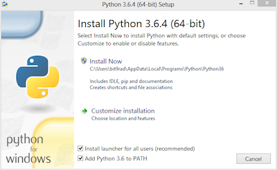

Installation
============

If you already have Python installed, skip to `Use Pip`_.

Install Python
--------------

Carbon Black Cloud Python SDK is compatible with Python 3.7+.  UNIX systems usually have Python installed by default;
it will have to be installed on Windows systems separately.

If you believe you have Python installed already, run the following two commands at a command prompt::

    $ python --version
    Python 3.7.5

    $ pip --version
    pip 20.2.3 from /usr/local/lib/python3.7/site-packages (python 3.7)

If ``python --version`` reports back a version of 3.7.x or higher, you’re all set.  If ``pip`` is not found, follow the
instructions on this `guide <https://pip.pypa.io/en/stable/installing/>`_.

.. note:: On many UNIX/Linux environments, the ``python`` and ``pip`` commands invoke Python version 2, for backwards
    compatibility. Python 2 is not compatible with the Carbon Black Cloud Python SDK. Python version 3 is invoked
    via the commands ``python3`` and ``pip3``.  Use these commands in this installation guide in place of
    ``python`` and ``pip``.

If you're on Windows, and Python is not installed yet, download the
`latest Python installer <https://www.python.org/downloads/>`_ from python.org.

Ensure that the "Add Python to PATH" option is checked.

Use Pip
-------

Once ``python`` and ``pip`` are installed, open a command prompt and type::

    $ pip install carbon-black-cloud-sdk

This will download and install the latest version of the SDK from the Python PyPI packaging server.

.. note:: In Python environments that implement `PEP 668 <https://peps.python.org/pep-0668/>`_ and declare their
    global packages to be "externally managed," the use of ``pip`` to install packages outside a virtual environment
    is no longer supported, unless overridden by a command-line option to ``pip`` (such as ``--break-system-packages``).
    For the use of virtual environments, see the next section and the
    `Python virtual environment guide <https://docs.python.org/3/library/venv.html>`_.

Virtual Environments (optional)
-------------------------------

If you are installing the SDK with the intent to contribute to it's development, it is recommended that you use
virtual environments to manage multiple installations.

A virtual environment is a Python environment such that the Python interpreter, libraries and scripts installed into
it are isolated from those installed in other virtual environments, and (by default) any libraries installed in a
“system” Python, i.e., one which is installed as part of your operating system [1]_.

See the python.org `virtual environment guide <https://docs.python.org/3/library/venv.html>`_ for more information.

Get Source Code
---------------

Carbon Black Cloud Python SDK is actively developed on GitHub and the code is available from the
`Carbon Black GitHub repository <https://github.com/carbonblack/carbon-black-cloud-sdk-python>`_.
The version of the SDK on GitHub reflects the latest development version.

To clone the latest version of the SDK repository from GitHub::

    $ git clone git@github.com:carbonblack/carbon-black-cloud-sdk-python.git

Once you have a copy of the source, you can install it in "development" mode into your Python ``site-packages``
directory::

    $ cd carbon-black-cloud-sdk-python
    $ python setup.py develop

This will link the version of ``carbon-black-cloud-sdk-python`` you cloned into your Python ``site-packages``
directory. Any changes you make to the cloned version of the SDK will be reflected in your local Python installation.
This is a good choice if you are thinking of changing or further developing ``carbon-black-cloud-sdk-python``.

.. [1] https://docs.python.org/3/library/venv.html
