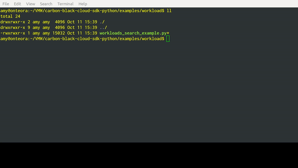

..
    # *******************************************************
    # Copyright (c) Broadcom, Inc. 2020-2024. All Rights Reserved. Carbon Black.
    # SPDX-License-Identifier: MIT
    # *******************************************************
    # *
    # * DISCLAIMER. THIS PROGRAM IS PROVIDED TO YOU "AS IS" WITHOUT
    # * WARRANTIES OR CONDITIONS OF ANY KIND, WHETHER ORAL OR WRITTEN,
    # * EXPRESS OR IMPLIED. THE AUTHOR SPECIFICALLY DISCLAIMS ANY IMPLIED
    # * WARRANTIES OR CONDITIONS OF MERCHANTABILITY, SATISFACTORY QUALITY,
    # * NON-INFRINGEMENT AND FITNESS FOR A PARTICULAR PURPOSE.

Workloads
======================================

These APIs allow you to visualize the inventory of compute resources available under either vSphere
or AWS.

.. note::
  A *compute resource* is a virtual machine without a sensor installed.

The API operations center around the ``VCenterComputeResource`` object for vSphere compute resources,
or around the ``AWSComputeResource`` for AWS compute resources.

.. note::
  The object name ``ComputeResource`` is an alias for ``VCenterComputeResource``, provided for
  backwards compatibility with earlier versions of the SDK.

Search Compute Resources
------------------------
By querying on one of the compute resource object types, you can obtain a list of matching
compute resources.  The SDK supports filtering by a number of different criteria, which are different
for each compute resource type.

**For VCenterComputeResource:**

- ``appliance_uuid``
- ``cluster_name``
- ``datacenter_name``
- ``esx_host_name``
- ``esx_host_uuid``
- ``vcenter_name``
- ``vcenter_host_url``
- ``vcenter_uuid``
- ``name``
- ``host_name``
- ``ip_address``
- ``device_guid``
- ``registration_id``
- ``eligibility``
- ``eligibility_code``
- ``installation_status``
- ``installation_type``
- ``uuid``
- ``os_description``
- ``os_type``
- ``os_architecture``
- ``vmwaretools_version``

**For AWSComputeResource:**

- ``auto_scaling_group_name``
- ``availability_zone``
- ``cloud_provider_account_id``
- ``cloud_provider_resource_id``
- ``cloud_provider_tags``
- ``id``
- ``installation_status``
- ``name``
- ``platform``
- ``platform_details``
- ``region``
- ``subnet_id``
- ``virtual_private_cloud_id``

Any of these criteria may be specified to be included in search results by calling the method ``set_XXX``,
or excluded by calling the method ``exclude_XXX``, where ``XXX`` is the specific criteria name.

Example (vSphere workloads)::

  >>> from cbc_sdk import CBCloudAPI
  >>> from cbc_sdk.workload import VCenterComputeResource

  >>> cbc = CBCloudAPI()
  >>> query = cbc.select(VCenterComputeResource).set_os_type(['WINDOWS']).set_cluster_name(['example-cluster-name'])
  >>> for result in list(query):
  ...     print(result)

Example Output::

  VCenterComputeResource object, bound to https://defense-dev01.cbdtest.io.
  -------------------------------------------------------------------------------

          appliance_uuid: c74bca54-e903-49e8-9962-2bb895f428c1
            cluster_name: example-cluster-name
              created_at: 2021-02-25T04:54:41.362Z
         datacenter_name: cwp-bucket-1-datacenter
             eligibility: ELIGIBLE
        eligibility_code: None
           esx_host_name: 10.105.17.113
           esx_host_uuid: a2311b42-3e53-8f21-97d7-66680007185f
               host_name: appd2012
                      id: 19902164
     installation_status: NOT_INSTALLED
    installation_status_code:
              ip_address: 10.105.17.84
                    name: cwp-bucket-1-windows_2012
         os_architecture: 64
          os_description: Microsoft Windows Server 2012 (64-bit)
                 os_type: WINDOWS
                    uuid: 500e14e6-3ea6-23aa-11bd-8e68444c6ce4
        vcenter_host_url: 10.105.17.114
            vcenter_name: VMware vCenter Server 6.7.0 build-14368073
            vcenter_uuid: 9a8a0be5-ae1e-49ce-b2aa-34bc7dc445e3
     vmwaretools_version: 11328
  VCenterComputeResource object, bound to https://defense-dev01.cbdtest.io.
  -------------------------------------------------------------------------------

          appliance_uuid: c74bca54-e903-49e8-9962-2bb895f428c1
            cluster_name: example-cluster-name
              created_at: 2021-02-25T04:54:41.362Z
         datacenter_name: cwp-bucket-1-datacenter
             eligibility: ELIGIBLE
        eligibility_code: None
           esx_host_name: 10.105.17.113
           esx_host_uuid: a2311b42-3e53-8f21-97d7-66680007185f
               host_name: appd2k8r2
                      id: 19902168
     installation_status: NOT_INSTALLED
    installation_status_code:
              ip_address: 10.105.17.237
                    name: cwp-bucket-1-windows_2008
         os_architecture: 64
          os_description: Microsoft Windows Server 2008 R2 (64-bit)
                 os_type: WINDOWS
                    uuid: 500e51ff-ca0d-5a70-a799-2595c9e87000
        vcenter_host_url: 10.105.17.114
            vcenter_name: VMware vCenter Server 6.7.0 build-14368073
            vcenter_uuid: 9a8a0be5-ae1e-49ce-b2aa-34bc7dc445e3
     vmwaretools_version: 11328 ComputeResource object, bound to https://defense-dev01.cbdtest.io.

Example (AWS workloads)::

    >>> from cbc_sdk import CBCloudAPI
    >>> from cbc_sdk.workload import AWSComputeResource

    >>> cbc = CBCloudAPI()
    >>> query = cbc.select(AWSComputeResource).set_region(['us-west-1'])
    >>> results = list(query)
    >>> for result in results:
    ...     print(result)

Example Output::

    AWSComputeResource object, bound to https://defense-dev01.cbdtest.io.
    -------------------------------------------------------------------------------

             auto_scaling_group_name: Demo-AutoScalingGroup
                   availability_zone: us-west-1c
           cloud_provider_account_id: 267678331262
          cloud_provider_resource_id: i-043de738ce129b77a
                 cloud_provider_tags: [list:4 items]:
                                      [0]: Name##Demo-ASG
                                      [1]: aws:ec2launchtemplate:id##lt-0e3d35dba4f5ba16f
                                      [2]: aws:autoscaling:groupName##Demo-AutoScalingGroup
                                      [...]
                         create_time: 2022-06-02T05:23:27Z
                     deployment_type: AWS
                         eligibility: NOT_ELIGIBLE
                    eligibility_code: [list:1 item]:
                                      [0]: SSM_DOC_NOT_INSTALLED
                         external_ip: 18.144.80.202
                                  id: 8x5tjvywq-aws-i-043de738ce129b77a
                   image_description: Amazon Linux 2 Kernel 5.10 AMI 2.0.20220426.0 x...
                            image_id: ami-02541b8af977f6cdd
                          image_name: amzn2-ami-kernel-5.10-hvm-2.0.20220426.0-x86_64...
                 installation_status: NOT_INSTALLED
            installation_status_code: None
        installation_status_code_key: None
                      instance_state: running
                       instance_type: t2.micro
                         internal_ip: 172.31.11.73
                                name: Demo-ASG
                             org_key: 8X5TJVYWQ
                            platform: Unix/Linux
                    platform_details: Linux/UNIX
                       platform_name: None
                    platform_version: None
                              region: us-west-1
                   security_group_id: [list:1 item]:
                                      [0]: sg-085972ee2f0be60aa
                           subnet_id: subnet-03cb2d09e07350698
            virtual_private_cloud_id: vpc-0faa4803c3de51c87
    AWSComputeResource object, bound to https://defense-dev01.cbdtest.io.
    -------------------------------------------------------------------------------

             auto_scaling_group_name: None
                   availability_zone: us-west-1c
           cloud_provider_account_id: 267678331262
          cloud_provider_resource_id: i-0febda35fcaf2dbd1
                 cloud_provider_tags: [list:1 item]:
                                      [0]: Name##Rushit-Test-2
                         create_time: 2022-07-11T08:26:58Z
                     deployment_type: AWS
                         eligibility: NOT_ELIGIBLE
                    eligibility_code: [list:1 item]:
                                      [0]: SSM_DOC_NOT_INSTALLED
                         external_ip: 54.193.100.2
                                  id: 8x5tjvywq-aws-i-0febda35fcaf2dbd1
                   image_description: Amazon Linux 2 Kernel 5.10 AMI 2.0.20220606.1 x...
                            image_id: ami-0d9858aa3c6322f73
                          image_name: amzn2-ami-kernel-5.10-hvm-2.0.20220606.1-x86_64...
                 installation_status: NOT_INSTALLED
            installation_status_code: None
        installation_status_code_key: None
                      instance_state: running
                       instance_type: t2.micro
                         internal_ip: 172.31.7.55
                                name: Rushit-Test-2
                             org_key: 8X5TJVYWQ
                            platform: Unix/Linux
                    platform_details: Linux/UNIX
                       platform_name: None
                    platform_version: None
                              region: us-west-1
                   security_group_id: [list:1 item]:
                                      [0]: sg-08473e77b9e4921e3
                           subnet_id: subnet-03cb2d09e07350698
            virtual_private_cloud_id: vpc-0faa4803c3de51c87
    AWSComputeResource object, bound to https://defense-dev01.cbdtest.io.
    -------------------------------------------------------------------------------

             auto_scaling_group_name: Demo-AutoScalingGroup
                   availability_zone: us-west-1a
           cloud_provider_account_id: 267678331262
          cloud_provider_resource_id: i-0b8b62d7c3aea1f9f
                 cloud_provider_tags: [list:5 items]:
                                      [0]: Name##Demo-ASG
                                      [1]: Test##Rushit-ASG
                                      [2]: aws:ec2launchtemplate:id##lt-0e3d35dba4f5ba16f
                                      [...]
                         create_time: 2022-06-02T05:21:26Z
                     deployment_type: AWS
                         eligibility: NOT_ELIGIBLE
                    eligibility_code: [list:1 item]:
                                      [0]: SSM_DOC_NOT_INSTALLED
                         external_ip: 54.176.174.194
                                  id: 8x5tjvywq-aws-i-0b8b62d7c3aea1f9f
                   image_description: Amazon Linux 2 Kernel 5.10 AMI 2.0.20220426.0 x...
                            image_id: ami-02541b8af977f6cdd
                          image_name: amzn2-ami-kernel-5.10-hvm-2.0.20220426.0-x86_64...
                 installation_status: NOT_INSTALLED
            installation_status_code: None
        installation_status_code_key: None
                      instance_state: running
                       instance_type: t2.micro
                         internal_ip: 172.31.17.166
                                name: Demo-ASG
                             org_key: 8X5TJVYWQ
                            platform: Unix/Linux
                    platform_details: Linux/UNIX
                       platform_name: None
                    platform_version: None
                              region: us-west-1
                   security_group_id: [list:1 item]:
                                      [0]: sg-085972ee2f0be60aa
                           subnet_id: subnet-02ccab8946d24f386
            virtual_private_cloud_id: vpc-0faa4803c3de51c87

Fetch Compute Resource by ID
----------------------------
Using a query of the ``VCenterComputeResource`` or ``AWSComputeResource`` objects, you can get the
compute resource by ID from your organization.

Example (vCenter workloads)::

    >>> from cbc_sdk import CBCloudAPI
    >>> from cbc_sdk.workload import VCenterComputeResource

    >>> # This is an example id that we want to query
    >>> id = 15054425

    >>> cbc = CBCloudAPI()
    >>> query = cbc.select(VCenterComputeResource, id)

    >>> # A string object is returned here, so we can print the result directly.
    >>> print(query)

    VCenterComputeResource object, bound to https://defense-dev01.cbdtest.io.
     Last refreshed at Mon Mar  1 12:02:14 2021
    -------------------------------------------------------------------------------

              appliance_uuid: c89f183b-f201-4bca-bacc-80184b5b8823
                cluster_name: example-cluster-name
                  created_at: 2020-11-18T07:41:16.834Z
             datacenter_name: None
                 eligibility: NOT_ELIGIBLE
            eligibility_code: ['Launcher not found']
               esx_host_name: 10.105.7.129
               esx_host_uuid: bb8d2842-0438-9a74-7964-1d0efad10f28
                   host_name: localhost.localdomain
                          id: 15054425
         installation_status: NOT_INSTALLED
        installation_status_code: None
                  ip_address: 10.105.7.201
                        name: CB-ServiceTest
             os_architecture: 64
              os_description: CentOS 7 (64-bit)
                     os_type: CENTOS
                        uuid: 5022227f-947a-84f8-5816-747f5e18e5ac
            vcenter_host_url: 10.105.5.63
                vcenter_name: VMware vCenter Server 7.0.0 build-15952599
                vcenter_uuid: 4a6b1382-f917-4e1a-8564-374cb7274bd7
         vmwaretools_version: 10336

Example (AWS workloads)::

    >>> from cbc_sdk import CBCloudAPI
    >>> from cbc_sdk.workload import AWSComputeResource

    >>> # This is an example id that we want to query
    >>> id = '8x5tjvywq-aws-i-043de738ce129b77a'

    >>> cbc = CBCloudAPI()
    >>> query = cbc.select(AWSComputeResource, id)

    >>> # A string object is returned here, so we can print the result directly.
    >>> print(query)
    AWSComputeResource object, bound to https://defense-dev01.cbdtest.io.
     Last refreshed at Wed Oct 12 11:11:41 2022
    -------------------------------------------------------------------------------

             auto_scaling_group_name: Demo-AutoScalingGroup
                   availability_zone: us-west-1c
           cloud_provider_account_id: 267678331262
          cloud_provider_resource_id: i-043de738ce129b77a
                 cloud_provider_tags: [list:4 items]:
                                      [0]: Name##Demo-ASG
                                      [1]: aws:ec2launchtemplate:id##lt-0e3d35dba4f5ba16f
                                      [2]: aws:autoscaling:groupName##Demo-AutoScalingGroup
                                      [...]
                         create_time: 2022-06-02T05:23:27Z
                     deployment_type: AWS
                         eligibility: NOT_ELIGIBLE
                    eligibility_code: [list:1 item]:
                                      [0]: SSM_DOC_NOT_INSTALLED
                         external_ip: 18.144.80.202
                                  id: 8x5tjvywq-aws-i-043de738ce129b77a
                   image_description: Amazon Linux 2 Kernel 5.10 AMI 2.0.20220426.0 x...
                            image_id: ami-02541b8af977f6cdd
                          image_name: amzn2-ami-kernel-5.10-hvm-2.0.20220426.0-x86_64...
                 installation_status: NOT_INSTALLED
            installation_status_code: None
        installation_status_code_key: None
                      instance_state: running
                       instance_type: t2.micro
                         internal_ip: 172.31.11.73
                                name: Demo-ASG
                             org_key: 8X5TJVYWQ
                            platform: Unix/Linux
                    platform_details: Linux/UNIX
                       platform_name: None
                    platform_version: None
                              region: us-west-1
                   security_group_id: [list:1 item]:
                                      [0]: sg-085972ee2f0be60aa
                           subnet_id: subnet-03cb2d09e07350698
            virtual_private_cloud_id: vpc-0faa4803c3de51c87

Facet Compute Resources
-----------------------

Any compute resource search may be turned into a *faceting* by calling the ``facet()`` method on the
query object returned by ``select()``, after setting search criteria.  A faceting breaks down each
specified field for all compute resources matching the criteria, showing which values that field can take
and how many times that field value shows up in the matching compute resources.  Only a subset of fields
can be faceted on, as listed here:

**For VCenterComputeResource:**

- ``eligibility``
- ``installation_status``
- ``vmwaretools_version``
- ``os_type``

**For AWSComputeResource:**

- ``auto_scaling_group_name``
- ``cloud_provider_tags``
- ``platform``
- ``platform_details``
- ``virtual_private_cloud_id``

Example (vCenter workloads)::

    >>> from cbc_sdk import CBCloudAPI
    >>> from cbc_sdk.workload import VCenterComputeResource
    >>> cbc = CBCloudAPI()
    >>> query = cbc.select(VCenterComputeResource)
    >>> facets = query.facet(['os_type', 'eligibility'])
    >>> for facet in facets:
    ...    print facet
    ...
    ComputeResourceFacet object, bound to https://defense-dev01.cbdtest.io.
    -------------------------------------------------------------------------------

         field: os_type
            id: os_type
        values: [list:6 items]:
                [0]: [ComputeResourceFacetValue object]:
                        id: OTHER
                      name: OTHER
                     total: 230

                [1]: [ComputeResourceFacetValue object]:
                        id: UBUNTU
                      name: UBUNTU
                     total: 68

                [2]: [ComputeResourceFacetValue object]:
                        id: WINDOWS
                      name: WINDOWS
                     total: 46

                [...]
    ComputeResourceFacet object, bound to https://defense-dev01.cbdtest.io.
    -------------------------------------------------------------------------------

         field: eligibility
            id: eligibility
        values: [list:3 items]:
                [0]: [ComputeResourceFacetValue object]:
                        id: NOT_ELIGIBLE
                      name: NOT_ELIGIBLE
                     total: 237

                [1]: [ComputeResourceFacetValue object]:
                        id: UNSUPPORTED
                      name: UNSUPPORTED
                     total: 185

                [2]: [ComputeResourceFacetValue object]:
                        id: ELIGIBLE
                      name: ELIGIBLE
                     total: 25

Example (AWS workloads)::

    >>> from cbc_sdk import CBCloudAPI
    >>> from cbc_sdk.workload import AWSComputeResource
    >>> cbc = CBCloudAPI()
    >>> query = cbc.select(AWSComputeResource)
    >>> facets = query.facet(['platform', 'virtual_private_cloud_id'])
    >>> for facet in facets:
    ...    print facet
    ...
    ComputeResourceFacet object, bound to https://defense-dev01.cbdtest.io.
    -------------------------------------------------------------------------------

         field: virtual_private_cloud_id
            id: virtual_private_cloud_id
        values: [list:8 items]:
                [0]: [ComputeResourceFacetValue object]:
                        id: vpc-02371233d7ac6d33c
                      name: vpc-02371233d7ac6d33c
                     total: 28

                [1]: [ComputeResourceFacetValue object]:
                        id: vpc-5102d53a
                      name: vpc-5102d53a
                     total: 12

                [2]: [ComputeResourceFacetValue object]:
                        id: vpc-0968a1d4ea101fc26
                      name: vpc-0968a1d4ea101fc26
                     total: 7

                [...]
    ComputeResourceFacet object, bound to https://defense-dev01.cbdtest.io.
    -------------------------------------------------------------------------------

         field: platform
            id: platform
        values: [list:2 items]:
                [0]: [ComputeResourceFacetValue object]:
                        id: Unix/Linux
                      name: Unix/Linux
                     total: 56

                [1]: [ComputeResourceFacetValue object]:
                        id: Windows
                      name: Windows
                     total: 5

Download Compute Resource Listings
----------------------------------

The details of compute resources matching a search may be directly downloaded from the Carbon Black Cloud
by callin the ``download()`` method on the query object returned by ``select()``, after setting
search criteria.  The format for downloading may be specified as either JSON or CSV.

The ``download()`` method returns a ``Job`` object, which is processed asynchronously and from which
the results are available once the job has been completed.

Example (vCenter workloads)::

    >>> from cbc_sdk import CBCloudAPI
    >>> from cbc_sdk.workload import VCenterComputeResource
    >>> cbc = CBCloudAPI()
    >>> query = cbc.select(VCenterComputeResource).set_os_type(["UBUNTU"]).set_eligibility(["ELIGIBLE"])
    >>> query.set_installation_status(["ERROR"])
    >>> job = query.download("CSV")
    >>> job.await_completion()
    >>> print(job.get_output_as_string())
    Eligibility,Install Status,Name,OS,VMware Tools,Added Time,VM ID,VM name,IP address,Datacenter,Cluster,vCenter [...]
    "ELIGIBLE",""ERROR"","wdc-10-180-200-134","UBUNTU","10336",""2021-07-27T11:01:01.636","776bf589-923e-4ccd-869d-[...]
    "ELIGIBLE",""ERROR"","","UBUNTU","0",""2021-11-19T08:49:20.882","50294288-5baa-6e71-18f0-71c8a17f0caf","POC-DB-[...]
    "ELIGIBLE",""ERROR"","ubunti1804desktop","UBUNTU","10338",""2022-04-04T04:54:50.861","503410f6-80aa-1f69-0285-[...]
    "ELIGIBLE",""ERROR"","ubunti1804desktop","UBUNTU","10338",""2022-02-28T09:22:32.235","503410f6-80aa-1f69-0285-[...]
    >>> # note: lines truncated in above output for formatting purposes

Example (AWS workloads)::

    >>> from cbc_sdk import CBCloudAPI
    >>> from cbc_sdk.workload import AWSComputeResource

    >>> cbc = CBCloudAPI()
    >>> query = cbc.select(AWSComputeResource).set_region(['us-west-1'])
    >>> job = query.download("CSV")
    >>> job.await_completion()
    >>> print(job.get_output_as_string())
    Instance ID,Platform,Account ID,VPC ID,Added Time,AWS Tags,ASG,Instance Type,Image ID,Image name,Image [...]
    "i-043de738ce129b77a","Unix/Linux","267678331262","vpc-0faa4803c3de51c87","2022-06-02T05:23:27",[...]
    "i-0febda35fcaf2dbd1","Unix/Linux","267678331262","vpc-0faa4803c3de51c87","2022-07-11T08:26:58",[...]
    "i-0b8b62d7c3aea1f9f","Unix/Linux","267678331262","vpc-0faa4803c3de51c87","2022-06-02T05:21:26",[...]
    >>> # note: lines truncated in above output for formatting purposes

Summarize Compute Resources
---------------------------

.. note::
  This functionality is not available for vCenter compute resources.

By calling the ``summarize()`` method on the query object returned by ``select()``, after setting
search criteria, a summary of compute resources may be generated.  The fields which may be summarized
are as follows:

**For AWSComputeResource:**

- ``availability_zone``
- ``region``
- ``subnet_id``
- ``virtual_private_cloud_id``
- ``security_group_id``

Example (AWS workloads)::

    >>> from cbc_sdk import CBCloudAPI
    >>> from cbc_sdk.workload import AWSComputeResource
    >>> cbc = CBCloudAPI()
    >>> query = cbc.select(AWSComputeResource)
    >>> summary = query.summarize(['availability_zone', 'region', 'virtual_private_cloud_id'])
    >>> print(summary)
    {'region': 5, 'availability_zone': 12, 'virtual_private_cloud_id': 8}

Interactive example script featuring Workloads Search
-----------------------------------------------------
We have a number of example scripts you can use with the CBC SDK.

This interactive script highlights the capabilities of the CBC SDK. It uses user input to guide you
through the functionalities of the Workloads Search.

You can download it from: `here <https://github.com/carbonblack/carbon-black-cloud-sdk-python/blob/develop/examples/workload/workloads_search_example.py>`_
